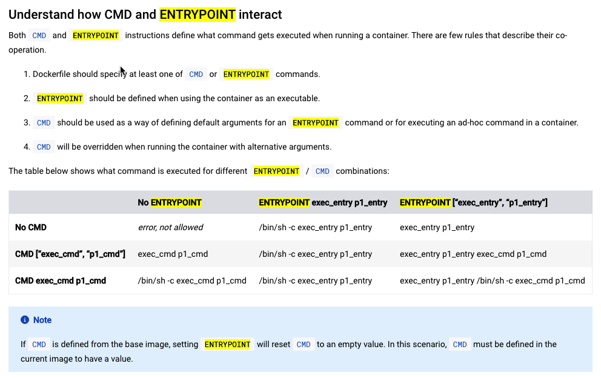

# dockerfiles

My dockerfiles. 

> Inspired by [willzhang/dockerfiles](https://github.com/willzhang/dockerfiles)

## [Dockerfile tutorial](https://docs.docker.com/engine/reference/builder/)

### [Understand how CMD and ENTRYPOINT interact](https://docs.docker.com/engine/reference/builder/#understand-how-cmd-and-entrypoint-interact)

